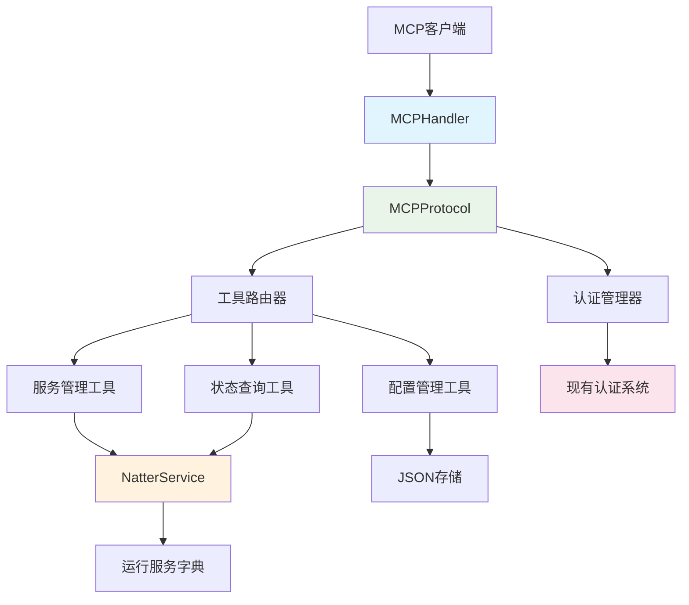

# 设计文档

## 概述

MCP服务功能将作为现有Natter Web平台的扩展模块，通过标准化的模型上下文协议（MCP）为外部工具和AI系统提供编程访问接口。该设计将在现有的单体HTTP服务器架构基础上，添加独立的MCP协议处理层，确保与现有功能的完全兼容性，同时提供高性能、安全的API访问能力。

## 导向文档对齐

### 技术标准 (tech.md)

本设计严格遵循项目现有的技术模式和标准：

- **Python单体架构**: 继续使用单一Python服务器模式，将MCP服务作为新的处理器类集成
- **最小依赖原则**: 只添加MCP协议支持所需的标准库依赖，避免引入重型第三方库
- **JSON数据存储**: 复用现有的JSON文件存储机制，无需引入数据库
- **线程安全**: 使用现有的threading.RLock()模式确保并发安全
- **认证体系**: 扩展现有的token认证机制支持MCP客户端

### 项目结构 (structure.md)

实现将遵循现有的项目组织约定：

- **类命名**: 使用PascalCase命名新类（如`MCPHandler`, `MCPProtocol`）
- **函数命名**: 使用snake_case命名方法（如`handle_mcp_request`, `get_service_status`）
- **文件组织**: 在server.py中添加MCP相关类，保持单文件架构
- **模块边界**: 明确分离MCP协议层与现有业务逻辑层
- **错误处理**: 遵循现有的异常处理和错误响应模式

## 代码重用分析

### 现有组件复用

- **NatterService类**: 直接复用所有服务管理功能（启动、停止、状态查询）
- **认证系统**: 扩展现有的`_authenticate_token()`和Basic认证机制
- **数据存储**: 复用`running_services`字典和JSON文件持久化
- **ServiceGroupManager**: 复用用户组权限管理逻辑
- **消息队列系统**: 集成现有的`queue_message()`推送机制

### 集成点

- **HTTP服务器**: 在现有`NatterHttpHandler`基础上添加MCP端点
- **认证流程**: 扩展现有认证方法支持MCP客户端凭据
- **服务管理**: 通过现有`running_services`字典访问服务实例
- **权限控制**: 集成`ServiceGroupManager`的组权限检查

## 架构

本设计采用分层架构模式，在现有HTTP服务器基础上添加MCP协议处理层：

### 模块化设计原则

- **单文件职责**: MCP相关功能集中在server.py的新增类中，保持文件职责清晰
- **组件隔离**: MCP协议处理与HTTP API处理分离，可独立测试
- **服务层分离**: MCP协议层、业务逻辑层、数据存储层清晰分离
- **工具模块化**: MCP工具方法专注单一功能，便于维护



## 组件和接口

### MCPHandler组件
- **目的**: 处理MCP协议的HTTP传输和WebSocket连接
- **接口**:
  - `handle_mcp_request(request)`: 处理MCP协议请求
  - `setup_websocket()`: 建立WebSocket连接（可选）
- **依赖**: 现有的BaseHTTPRequestHandler基础设施
- **复用**: 现有的HTTP服务器框架和认证中间件

### MCPProtocol组件
- **目的**: 实现MCP协议规范的消息处理和路由
- **接口**:
  - `process_message(message)`: 处理MCP消息
  - `list_tools()`: 返回可用工具列表
  - `execute_tool(tool_name, params)`: 执行特定工具
- **依赖**: JSON消息序列化、工具注册表
- **复用**: 现有的错误处理和响应格式化机制

### MCPToolRegistry组件
- **目的**: 管理和路由MCP工具调用到相应的业务逻辑
- **接口**:
  - `register_tool(name, handler)`: 注册新工具
  - `get_tool(name)`: 获取工具处理器
  - `list_available_tools(user_role)`: 根据权限列出可用工具
- **依赖**: 权限检查、工具元数据
- **复用**: 现有的ServiceGroupManager权限系统

### MCPServiceTools组件
- **目的**: 提供服务管理相关的MCP工具实现
- **接口**:
  - `list_services(user_context)`: 列出服务
  - `get_service_status(service_id)`: 获取服务状态
  - `start_service(params)`: 启动服务
  - `stop_service(service_id)`: 停止服务
- **依赖**: NatterService类、权限验证
- **复用**: 完全复用现有的NatterService管理逻辑

## 数据模型

### MCP请求模型
```python
{
    "jsonrpc": "2.0",
    "id": "unique_request_id",
    "method": "tools/call",
    "params": {
        "name": "natter/list_services",
        "arguments": {
            "filter": "running",
            "group": "default"
        }
    }
}
```

### MCP响应模型
```python
{
    "jsonrpc": "2.0",
    "id": "unique_request_id",
    "result": {
        "content": [
            {
                "type": "text",
                "text": "服务列表结果..."
            }
        ]
    }
}
```

### 服务状态模型（复用现有）
```python
{
    "id": "service_unique_id",
    "name": "服务显示名称",
    "status": "running|stopped|error",
    "mapped_address": "外网映射地址",
    "process_info": {
        "pid": 12345,
        "cpu_percent": 2.5,
        "memory_mb": 45.6
    },
    "config": {
        "local_port": 8080,
        "keep_alive": 30
    }
}
```

### 工具定义模型
```python
{
    "name": "natter/list_services",
    "description": "列出当前可访问的网络隧道服务",
    "inputSchema": {
        "type": "object",
        "properties": {
            "filter": {
                "type": "string",
                "enum": ["all", "running", "stopped"],
                "description": "服务状态过滤器"
            }
        }
    }
}
```

## 错误处理

### 错误场景

1. **MCP协议错误**
   - **处理**: 返回标准MCP错误响应，包含错误代码和描述
   - **用户影响**: 客户端收到结构化错误信息，可自动处理

2. **认证失败**
   - **处理**: 返回-32002认证错误，记录失败尝试
   - **用户影响**: 客户端需要重新提供有效凭据

3. **权限不足**
   - **处理**: 返回-32003权限错误，详细说明所需权限
   - **用户影响**: 客户端了解权限限制，可请求提升权限

4. **服务操作失败**
   - **处理**: 返回具体的业务错误，包含失败原因和建议
   - **用户影响**: 客户端获得可操作的错误信息

5. **网络连接中断**
   - **处理**: 实现自动重连机制，缓存未完成请求
   - **用户影响**: 透明的连接恢复，最小化用户感知

## 测试策略

### 单元测试
- MCP协议消息解析和序列化测试
- 工具注册和路由逻辑测试
- 认证和权限检查测试
- 错误处理和边界条件测试

### 集成测试
- 完整MCP工作流测试（握手→认证→工具调用→响应）
- 与现有HTTP API的兼容性测试
- 多客户端并发访问测试
- 权限隔离测试（管理员vs访客权限）

### 端到端测试
- 真实MCP客户端连接和操作测试
- 服务生命周期管理测试（启动→监控→停止）
- 故障恢复和错误处理测试
- 性能和负载测试

## 安全设计

### 认证机制
- 扩展现有token认证支持MCP客户端
- 支持API密钥和短期会话token两种模式
- 实现token刷新和安全轮换机制

### 授权控制
- 复用现有的ServiceGroupManager权限模型
- 基于用户角色的工具访问控制
- 细粒度的服务访问权限检查

### 输入验证
- 严格的JSON schema验证MCP消息格式
- 参数类型和范围检查防止注入攻击
- 文件路径和命令参数白名单验证

### 审计日志
- 记录所有MCP操作请求和响应
- 包含用户身份、操作类型、参数和结果
- 支持日志轮换和长期存储

## 部署考虑

### 向后兼容
- MCP功能作为可选模块，不影响现有HTTP API
- 环境变量控制MCP服务启用/禁用
- 现有客户端无需修改即可继续使用

### 配置管理
- 通过环境变量配置MCP服务端口和参数
- JSON配置文件存储MCP客户端权限设置
- 支持运行时配置热重载

### 监控集成
- 集成现有的服务监控和通知系统
- MCP操作纳入现有的IYUU推送机制
- 提供MCP特定的健康检查端点