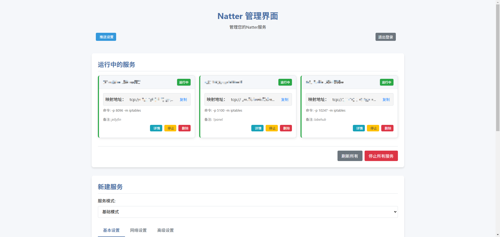
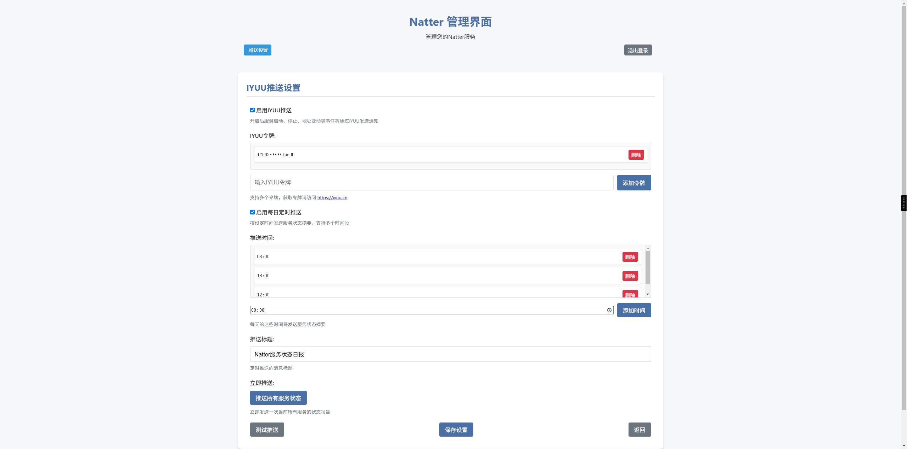

# Natter Web管理工具

这是Natter网络工具的Web管理界面，允许您通过浏览器轻松管理多个Natter服务实例。您可以启动、监控和管理多个Natter服务，查看实时状态，并通过IYUU消息推送接收服务状态通知。



## 项目概述

Natter Web管理工具为Natter网络穿透工具提供了直观的图形界面，帮助您:

- 轻松配置和启动新的端口转发服务
- 实时监控所有服务的运行状态
- 自动检测网络环境和NAT类型
- 接收服务状态变更的即时通知
- 通过IYUU推送接收服务状态报告

无论您是在家庭网络中搭建私人服务，还是需要在复杂网络环境中部署多个应用，Natter Web管理工具都能为您提供简单而强大的解决方案。

## 功能

- 启动新的Natter服务
- 监控运行中的服务状态
- 查看服务的实时日志输出
- 停止不需要的服务
- 支持基础模式和高级模式配置
- 保存和加载配置模板
- 批量管理服务
- 详细的帮助文档和故障排除指南
- 自动重启异常终止的服务
- LAN和WAN端口可用性实时显示
- NAT类型检测与显示
- IYUU消息推送支持（服务状态通知）
- 自定义定时状态报告

## 安装依赖

Natter Web管理工具需要安装psutil库来管理进程：

```bash
pip install psutil
```

## 使用方法

### 方法一：直接运行

1. 启动Web服务器：

```bash
python server.py [端口号]
```

默认端口为8080，您可以指定其他端口。

2. 打开浏览器访问：

```
http://localhost:8080
```

### 方法二：使用Docker（推荐）

我们提供了Docker支持，方便在容器中运行Natter Web管理工具：

```bash
# 使用默认配置运行
docker-compose up -d

# 或指定自定义Web端口
WEB_PORT=9090 docker-compose up -d
```

您也可以通过直接运行Docker容器来指定Web端口：

```bash
# 使用默认8080端口
docker run -d --name natter-web --network host -v ./data:/app/data nattertool/natter-web

# 或指定自定义Web端口
docker run -d --name natter-web --network host -e WEB_PORT=9090 -v ./data:/app/data nattertool/natter-web

# 或通过命令行参数指定Web端口
docker run -d --name natter-web --network host -v ./data:/app/data nattertool/natter-web 9090
```

详细的Docker使用说明请参阅[Docker文档](./web/DOCKER.md)。

## 服务管理说明

### 基础模式

基础模式提供简化的界面，主要配置分为三个部分：

1. **基本设置**
   - 目标端口：要转发的本地端口
   - UDP模式：是否使用UDP协议
   - 转发方法：选择转发实现方式

2. **网络设置**
   - 绑定接口：网络接口名称或IP地址
   - 绑定端口：Natter服务绑定的本地端口
   - UPnP/IGD发现：尝试通过UPnP协议配置路由器

3. **高级设置**
   - STUN服务器：用于NAT类型检测的服务器
   - 保活服务器：保持NAT映射的服务器
   - 保活间隔：发送保活包的时间间隔
   - 通知脚本：当映射地址变更时执行的脚本
   - 其他选项：自动重试、映射变更时退出等

### 高级模式

高级模式允许您直接输入完整的Natter命令行参数，适合高级用户使用。您还可以保存常用配置为模板，以便快速调用。

## 模板功能

模板功能让您可以保存常用的配置，以便在需要时快速启动相同配置的服务：

1. 保存模板：
   - 从现有服务保存 - 在服务详情页面点击"保存为模板"
   - 从当前配置保存 - 点击"保存配置"按钮

2. 加载模板：
   - 点击"加载配置"按钮，选择要使用的模板

3. 管理模板：
   - 查看所有保存的模板
   - 使用或删除模板

## 状态监控

服务详情页面提供了详细的状态监控功能：

- LAN可用性：本地网络访问状态
- WAN可用性：公网访问状态
- NAT类型：当前网络的NAT类型
- 详细日志：实时更新的服务输出日志

## 批量管理

支持批量管理多个运行中的Natter服务：

- 一键刷新所有：更新所有服务的状态
- 一键停止所有：停止所有运行中的服务

## IYUU推送功能

Natter Web管理工具支持通过IYUU推送接收服务状态通知：

- **服务状态变更推送**：服务启动、停止、映射地址变更等事件通知
- **定时状态报告**：可设置每日固定时间推送所有服务状态摘要
- **批量整合推送**：短时间内的多个事件会自动整合成单条推送，减少打扰
- **美观格式**：推送内容采用美观的富文本格式，突出显示重要信息

### 配置IYUU推送

1. 在设置页面启用IYUU推送功能
2. 添加您的IYUU令牌（可在IYUU.CN获取）
3. 配置定时推送的时间和内容（可选）
4. 使用"测试推送"按钮验证配置是否生效



## 故障排除

自动重启功能可以监控服务状态，在服务意外退出时自动重新启动，提高稳定性。

- **问题**: 服务状态显示"初始化中"但一直没变化
  **解决**: 检查natter.py路径是否正确，确保有足够权限运行

- **问题**: 无法获取映射地址
  **解决**: 等待几秒钟，Natter需要时间来获取映射地址；检查STUN服务器是否可用

- **问题**: 无法停止服务
  **解决**: 如果正常停止失败，管理工具会尝试强制终止进程

- **问题**: WAN状态显示CLOSED但本地可以访问
  **解决**: 可能是NAT类型不支持直接穿透，或者ISP阻止了特定端口的访问

## 注意事项

1. Web管理工具不会修改Natter的任何源代码
2. 所有服务管理通过进程控制实现
3. 确保Python环境中同时能够访问natter.py和server.py
4. 启用自动重启功能可能导致在某些情况下（如网络问题）持续重启循环

## 版本历史

### V2.0.0 (2025-01-15)
- 🚀 **重大更新：统一登录系统**
  - 新增统一登录页面，智能识别管理员和访客用户类型
  - 支持基于密码的智能用户身份识别和自动跳转
  - 实现Token和Basic Auth双重认证机制
- 👥 **全新访客系统**
  - 新增访客用户功能，支持只读服务查看
  - 支持创建多个访客组，每组独立密码管理
  - 访客用户可查看指定服务组的基本信息，但无法修改配置
- 🔐 **增强认证机制**
  - 重构认证系统，支持环境变量配置管理员密码
  - 新增JWT Token认证，提升安全性和用户体验
  - 统一登录入口，告别多种认证方式混乱
- 🎨 **界面优化**
  - 完全移除外部CSS/JS依赖，提升加载速度
  - 统一紫蓝渐变设计风格，支持毛玻璃效果
  - 优化响应式布局，完美支持移动端访问
- 🐳 **Docker配置更新**
  - 更新所有Docker配置文件支持新的环境变量
  - 新增完整的Docker部署指南文档
  - 支持ADMIN_PASSWORD、GUEST_ENABLED等新环境变量
- 📋 **服务组管理**
  - 管理员可创建、编辑、删除服务组
  - 支持为每个服务组分配特定的服务列表
  - 灵活的权限控制，精确管理访客访问范围

### V1.0.4 (2025-04-15)
- 优化IYUU推送消息格式，让通知更美观
- 修复定时推送重复问题
- 修复服务详情在IYUU推送中不完整的问题
- 改进批量消息整合逻辑，防止重复内容
- 优化测试推送功能，支持即时推送

### V1.0.3
- 增加IYUU推送支持
- 添加定时状态报告功能
- 改进服务状态监控

### V1.0.2
- 增加批量服务管理功能
- 添加模板保存和加载
- 优化界面交互体验

### V1.0.1
- 修复首次启动服务失败的问题
- 改进NAT类型检测准确性
- 增加自动重启功能

### V1.0.0
- 首次发布
- 支持基础服务管理功能
- 提供基础配置和高级配置模式
